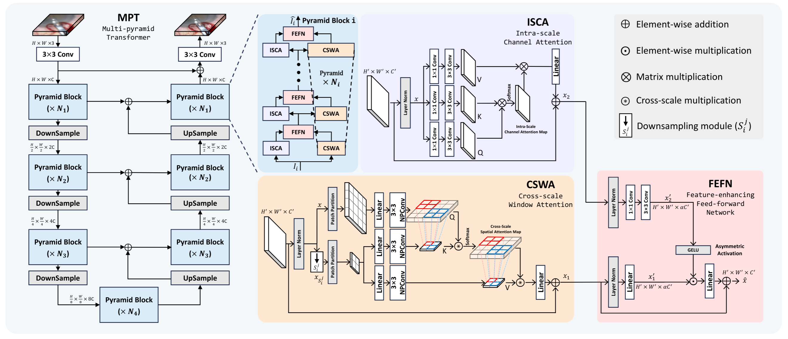
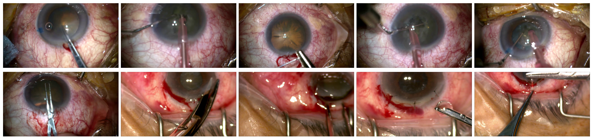

# A Unified Framework for Microscopy Defocus Deblur with Multi-Pyramid Transformer and Contrastive Learning
Yuelin Zhang, Pengyu Zheng, Wanquan Yan, Chengyu Fang, Shing Shin Cheng; Proceedings of the IEEE/CVF Conference on Computer Vision and Pattern Recognition (CVPR), 2024, pp. 11125-11136

[**paper**](https://openaccess.thecvf.com/content/CVPR2024/html/Zhang_A_Unified_Framework_for_Microscopy_Defocus_Deblur_with_Multi-Pyramid_Transformer_CVPR_2024_paper.html)

<div style="text-align: center;">
    
</div>

## Dataset

### CataBlur
We release CataBlur dataset.
CataBlur is a new surgical microscope defocus blur dataset, including 1208 defocus images collected from 5 cataract surgeries, for evaluation on real surgical defocus blur.

It can be downloaded from [Google Drive](https://drive.google.com/file/d/1jURA4WevmVh2rV85hMJVwHR1jkfNUN6l/view?usp=sharing).

<div style="text-align: center;">
    
</div>

Other open-source datasets can be downloaded from their original websites.

All downloaded datasets should be placed under the `Datasets` folder.

## Install

```bash
conda create -n MPT python=3.11
conda activate MPT
# If necessary, Replace pytorch-cuda=? with the compatible version of your GPU driver.
conda install pytorch==2.0.0 torchvision==0.15.1 torchaudio==2.0.1 pytorch-cuda=11.8 -c pytorch -c nvidia
pip install -r requirements.txt
```


## Train

To train the model with multiple GPUs, use the script.
```bash
sh train_dist.sh
```
To train the model with a single GPU, call the python script directly.
```bash
python run.py -net MPT -config config_MPT -data DATASETS_THAT_YOU_WANT_TO_USE -train True
```


## Test
All model weights can be downloaded at [here](https://drive.google.com/file/d/1YHrI2H6uRsB9wqMVqgoZPWaQpBGCWih-/view?usp=sharing).
Put the weight in `Weights` directory.

### Inference
```bash
python run_inference.py --data /path/to/your/images --pretrained /path/to/your/weights
```

### Evalutation
```bash
python run.py -net MPT -config config_MPT -data DATASETS_THAT_YOU_WANT_TO_USE \
        -train False -ckpt_name /path/to/your/weights
```


## Citation
If you find our work helpful, please consider citing our paper:
```bibtex
@inproceedings{zhang2024unified,
  title={A unified framework for microscopy defocus deblur with multi-pyramid transformer and contrastive learning},
  author={Zhang, Yuelin and Zheng, Pengyu and Yan, Wanquan and Fang, Chengyu and Cheng, Shing Shin},
  booktitle={Proceedings of the IEEE/CVF Conference on Computer Vision and Pattern Recognition},
  pages={11125--11136},
  year={2024}
}
```
